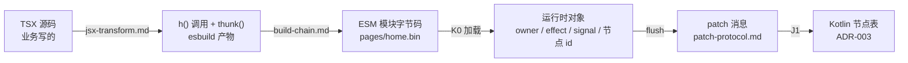
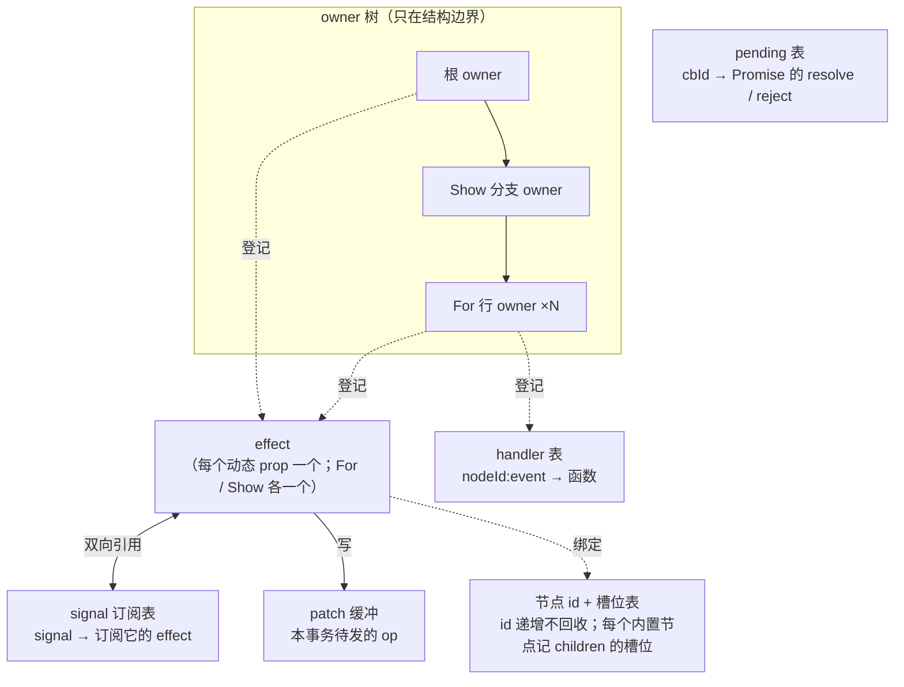
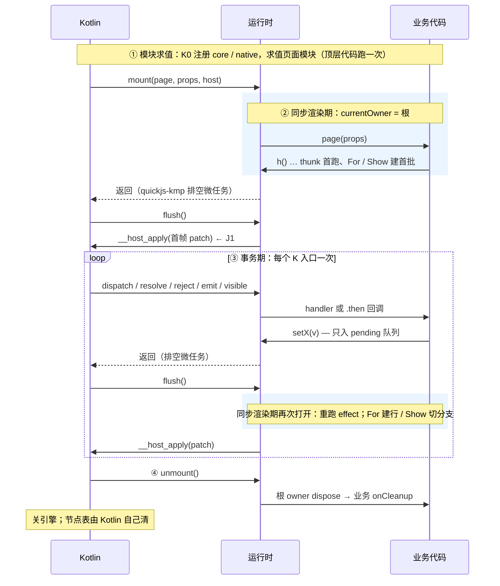
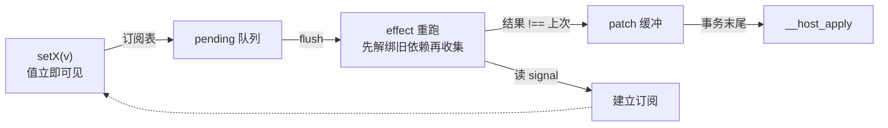

# JS 层总览：从 TSX 到 patch

- 状态：草案（2026-09-16）。本文是 JS 层的系统说明，三份契约（[runtime-api.md](./runtime-api.md)、[jsx-transform.md](./jsx-transform.md)、[patch-protocol.md](./patch-protocol.md)）是它的参考手册：定义在那边，"为什么"和"怎么连起来"在这边
- 前提：ADR-001（Signal、所有权）、ADR-002（事务、桥）、ADR-004（命令）、ADR-005（引擎、模块）

## 0. 六层



业务只看见第一层；框架的全部工作是把第一层的声明变成第六层的状态，并在状态变化时只动第五层里真正变了的几条。

## 1. 结构：一个页面在内存里有什么

一个页面 = 一个引擎 = 一份运行时对象。运行时里只有七样东西：



| 东西 | 由谁创建 | 挂在谁名下 | 什么时候没 |
|---|---|---|---|
| owner | `mount` 建根；`Show` 每次切分支建一个；`For` 每建一行建一个 | 根 owner 被运行时持有；分支 owner 被 `Show` 的 cleanup 持有；行 owner 被 `For` 持有 | dispose：跑名下 effect 的解绑与 cleanups。分支切换、行删除、卸载 |
| effect | `h()` 遇到 `thunk` prop；`effect()`；`For` / `Show` 自己 | 创建时的当前 owner | owner dispose 时；或它所属的 effect 重跑前（effect 内 `onCleanup`） |
| signal | `signal()`、`memo()`、`createResource()`、`For` 的 item accessor | 不挂任何名下，靠引用存活 | 没人引用时被 GC。订阅表里的 effect 被解绑后，signal 若无其他引用即回收 |
| 节点 id | `h()` 对内置类型分配 | 不是对象，只是整数；Kotlin 侧才有节点 | 不回收。`r` 之后不再出现 |
| 槽位表 | `h()` 处理 children 时 | 内置节点 | 随节点 `r` |
| handler | `h()` 遇到 `onXxx` | 通过 `onCleanup` 登记到当前 owner | owner dispose |
| pending 回调 | `__host_call` 时分配 cbId | 运行时全局一张表 | K3 到达时删；页面卸载即引擎关闭，整表消失 |
| patch 缓冲 | 运行时全局 | | 每次 flush 清空；E2 时清空不发 |

三条从图上直接读出来的事实：

- **组件不在图里。** 组件函数跑完就没了，它留下的只有它创建的节点 id、effect、handler，全都挂在结构 owner 名下。所以"组件卸载"这个概念不存在，只有"owner dispose"
- **effect 之间没有父子。** 行 owner 由 `For` 显式持有，不在 `For` 的 effect 之下；`For` 重跑（删一行）不会连累其他行的 effect
- **泄漏只有一种来源：没有 owner 的 effect。** 它不在任何 dispose 名单上，signal 的订阅表会永远持有它。这就是"同步渲染期外创建 effect 抛错"的理由

## 2. 时间：一个页面的四个时期



**同步渲染期**是唯一允许创建 effect 与登记 `onCleanup` 的窗口：`mount` 里的组件函数体、`flush` 里的 effect 重跑、`For` 建行、`Show` 切分支。图上蓝色的两段之外（handler 里、`.then` 里、定时器回调里）`currentOwner` 为空，运行时抛错。

**事务**是 Kotlin 的一次 K 入口到它的 `flush()` 返回。业务在事务里改 signal，值立刻可见但 effect 不跑；flush 时按入队顺序重跑，产出的 patch 攒成一条消息。一个 handler 改十个 signal 只出一条消息；同一事务里没人读到过"一半更新"的树。

**flush 为什么是第二次调用**：quickjs-kmp 在每次最外层调用返回前排空微任务队列。K3 的 `resolve()` 返回时业务的 `.then` 链才跑完、signal 才写入；flush 若放在 `resolve()` 函数体末尾会先于 `.then` 执行，放在微任务里会排在后续链节之前。只有 Kotlin 在同一次 `withEngine` 里再调一次 `flush()`，才保证"回送 → 回调 → 写入 → flush"落在同一事务。

## 3. 响应式闭环



依赖不是声明出来的，是执行时被观察到的：effect 跑的时候 `currentEffect` 指向它，期间任何 `x()` 读取都把它登记进 `x` 的订阅表。所以：

- 同一句 `count()`，在 thunk 里读会订阅，在 handler 里读只是取值
- `memo` 是拉取式的：写入后立刻读它得到新值，因为它在读取时发现自己脏了就重算；它的订阅者仍走 pending 队列
- 条件分支里的读取（`done() ? a() : b()`）只订阅这次真正读到的那个，因为每次重跑先解绑

## 4. 一个页面的一生

页面：拉一个待办列表，加载中显示占位，每行点击切换完成态。

```tsx
// pages/todos.tsx
import { signal, createResource, Column, Row, Text, Show, For } from "@tiny-ui/core";
import { http } from "@tiny-ui/native";

interface Todo { id: number; title: string; done: boolean }

export default function Todos() {
    const [todos] = createResource(() => http.get<Todo[]>("/todos"));
    return (
        <Column>
            <Text text={`${(todos() ?? []).length} todos`} />
            <Show when={todos()} fallback={() => <Text text="loading…" />}>
                {() => (
                    <Column>
                        <For each={todos()!} key={(t) => t.id}>
                            {(todo) => <TodoRow todo={todo()} />}
                        </For>
                    </Column>
                )}
            </Show>
        </Column>
    );
}

function TodoRow(props: { todo: Todo }) {
    const [done, setDone] = signal(props.todo.done);
    return (
        <Row onClick={() => setDone(!done())}>
            <Text text={props.todo.title} color={done() ? "#999999" : "#000000"} />
        </Row>
    );
}
```

### 4.1 编译

CLI 只做两件事：含调用 / 属性访问的属性表达式包成 `thunk`，JSX 变成 `h()`。事件、`key`、`fallback`、渲染函数是函数，原样保留。

```js
function Todos() {
    const [todos] = createResource(() => http.get("/todos"));
    return h(Column, null,
        h(Text, { text: thunk(() => `${(todos() ?? []).length} todos`) }),
        h(Show, { when: thunk(() => todos()), fallback: () => h(Text, { text: "loading…" }) },
            () => h(Column, null,
                h(For, { each: thunk(() => todos()), key: (t) => t.id },
                    (todo) => h(TodoRow, { todo: thunk(() => todo()) })))));
}
function TodoRow(props) {
    const [done, setDone] = signal(props.todo.done);
    return h(Row, { onClick: () => setDone(!done()) },
        h(Text, { text: thunk(() => props.todo.title), color: thunk(() => done() ? "#999999" : "#000000") }));
}
```

`todo={todo()}` 被包成 `thunk(() => todo())`，`TodoRow` 里 `props.todo` 是 getter，读到的是该行 item accessor 的实时值。

### 4.2 挂载（事务 1）

`mount()` 建根 owner，调 `Todos(props)`。JS 先求值参数再调用，所以子节点先于父节点建：

| 步骤 | 运行时里发生的 | patch |
|---|---|---|
| `createResource` | 建 `data` / `loading` / `error` 三个 signal；分配 cbId 1 存进 pending 表；`__host_call("http.get", 1, …)` | |
| `h(Text, {text: thunk})` | 分配 id 1；建 effect E1，首跑读 `data`（undefined）→ 订阅 | `["c",1,"Text"] ["p",1,"text","0 todos"]` |
| `h(Show, …)` | 建 effect E2，首跑读 `data` → 假 → 建分支 owner O1，在其中调 fallback：id 2 | `["c",2,"Text"] ["p",2,"text","loading…"]` |
| `h(Column, null, 节点1, Show槽位)` | 分配 id 3；槽位表 `[节点1, Show(O1: [2])]` | `["i",3,1,0] ["i",3,2,1]` |
| `mount` 收尾 | 根节点 3 挂到根容器 | `["i",0,3,0]` |

`mount()` 返回，Kotlin 调 `flush()`：pending 队列为空，缓冲里 8 条 op 一次交给 J1。此刻内存里：根 owner（含 E1、E2）、O1（空）、3 个 signal、pending 表 1 项、handler 表空。

### 4.3 数据回来（事务 2）

Kotlin 拿到响应，`resolve(1, "[{id:1,title:'Buy milk',done:false},{id:2,title:'Call mom',done:true}]")`。运行时从 pending 表取出 resolver 调用，返回；quickjs-kmp 排空微任务：`createResource` 的 `.then` 写 `data`，E1、E2 入队。Kotlin 调 `flush()`：

| effect | 做什么 | patch |
|---|---|---|
| E1 重跑 | `"2 todos"` !== 上次 | `["p",1,"text","2 todos"]` |
| E2 重跑 | 真值性变了：dispose O1、删节点 2；建 O2，在其中调分支函数 | `["r",2]` |
| 分支函数 | `h(For, …)` 建 effect E3，首跑读 `data`，reconcile `[]` → `[1, 2]`：每个 key 建行 owner R1 / R2，各自调 `TodoRow`。行内：`signal(done)`、Text 的两个 effect（订阅 item accessor 与 `done`）、Row 的 handler 进 handler 表并登记到行 owner | `["c",5,"Text"] ["p",5,"text","Buy milk"] ["p",5,"color","#000000"] ["c",6,"Row"] ["p",6,"onClick",true] ["i",6,5,0]`，第二行同形（id 7、8） |
| 分支根 `h(Column)` | 分配 id 4；槽位表 `[For(R1: 6, R2: 8)]` | `["i",4,6,0] ["i",4,8,1]` |
| Show 槽位 | 把新分支根插到节点 3 的槽位 1 | `["i",3,4,1]` |

一条消息 17 个 op。E1 先于 E2 跑，因为两者按订阅 `data` 的顺序入队。

### 4.4 点击（事务 3）

用户点第一行。Kotlin `dispatch(6, "onClick", "{}")`：查 handler 表 `6:onClick`，调用；`setDone(true)` 把 color effect 入队。`flush()`：

```json
[["p",5,"color","#999999"]]
```

Row、Column、另一行全程没被碰。不是比对后发现没变，是根本不在链路上。

### 4.5 列表变化（事务 4）

业务某处 `refetch()`，新数据里第 2 条没了、第 1 条改了标题、多了第 3 条。K3 回送后 `data` 写入，E1 与 E3 入队（行内 effect 不订阅 `data`）：

| effect | 做什么 | patch |
|---|---|---|
| E1 | 计数 | `["p",1,"text","2 todos"]`（值相同则不发） |
| E3 reconcile `[1,2]` → `[1,3]` | key 2：dispose R2（解绑两个 effect、删 `8:onClick`），发 `r`；key 1：item 引用变了，写该行的 item accessor，行内 title effect 入队；key 3：建 R3 | `["r",8]` `["c",9,"Text"] … ["c",10,"Row"] ["p",10,"onClick",true] ["i",10,9,0]` `["i",4,10,1]` |
| 行 1 的 title effect | 同一 flush 内继续 | `["p",5,"text","Buy oat milk"]` |

行 1 没有重建：它的 `done` signal、handler、节点 id 都保留。这是 item 用 accessor 而不是值的原因。

### 4.6 卸载

`unmount()`：根 owner dispose → 跑 cleanups：`Show` 登记的 cleanup dispose O2 → `For` 登记的 cleanup dispose 全部行 owner → 各行的 effect 解绑、handler 删除、业务 `onCleanup` 执行。不发任何 patch；Kotlin 随后关引擎、清节点表。pending 表里未回的请求随引擎消失。

## 5. 规则表

每条"必须 / 不能"都是前四节的推论，第三列指向出处。

| 规则 | 违反时 | 由谁推出 |
|---|---|---|
| effect / `onCleanup` 只能在同步渲染期创建 | 抛错 | §1：没有 owner 的 effect 永远不会被清理 |
| 组件函数只跑一次，必须同步返回一个节点 | `async` / 返回 Promise 抛 E2 | §2：`await` 之后已在渲染期外；§1：组件不在图里，没有第二次机会 |
| children 创建后不可变；结构变化只经 `For` / `Show` | 编译期报错 | §1：只有 `For` / `Show` 开 owner，别处建的节点没人负责删 |
| `For` / `Show` 只能直接写在内置节点的 children 里 | `h()` 抛 E2 | §1：槽位表挂在内置节点上，它们需要一个父节点来算 index |
| 动态 prop 由编译器包 `thunk`，值本身不能是函数 | 函数型 prop 抛 E2 | §4.1：运行时靠包装区分"动态 prop"与"渲染函数"；ADR-002：函数不过桥 |
| 数组 / 对象整体替换才触发 | `list().push(x)` 静默无效 | §3：`===` 判等；v1 没有 Proxy 追踪 |
| `For` 的 item 是 accessor | 写 `todo.title` 类型错 | §4.5：同 key 元素换引用时更新行而不重建行 |
| `Show` 只在真值性变化时切分支 | | §4.3：切分支 = 重建整棵分支，值变化不该付这个代价 |
| 同一 flush 内一个 effect 重跑超过 100 次 | 抛 E2 | §3：effect 写自己读的 signal 会成环 |
| K 入口 = 入口函数 + `flush()` 两次调用 | 少调 flush 则 patch 滞留到下一事务 | §2：微任务在入口返回前排空 |
| E1 不回滚 signal | | ADR-002 §3.5：signal 已写、effect 没跑会让 UI 与状态分叉 |
| E2 丢弃整条消息 | | §2：Kotlin 不能拿到半棵树 |
| 节点 id 不回收 | | §1：id 只是整数，Kotlin 侧靠它对上号，复用会让在途事件指错节点 |
